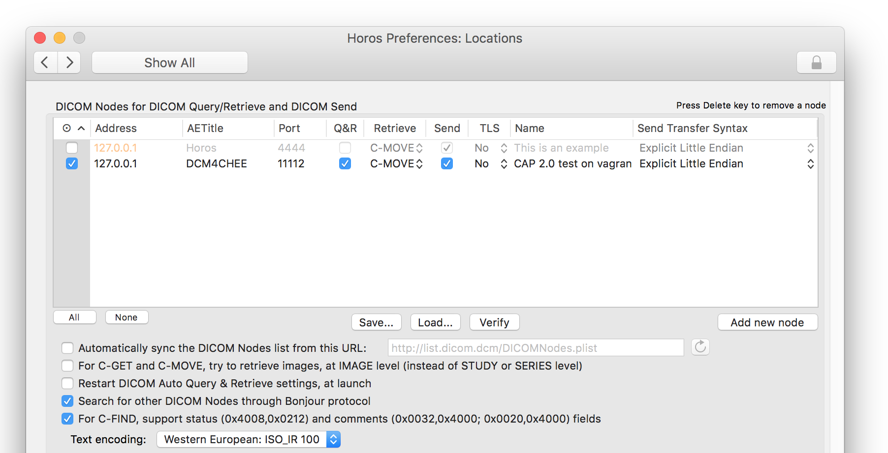
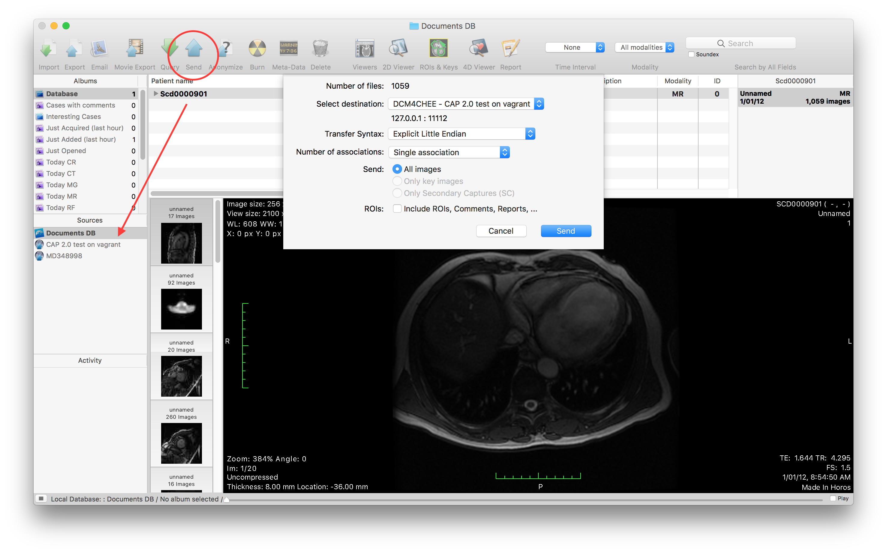
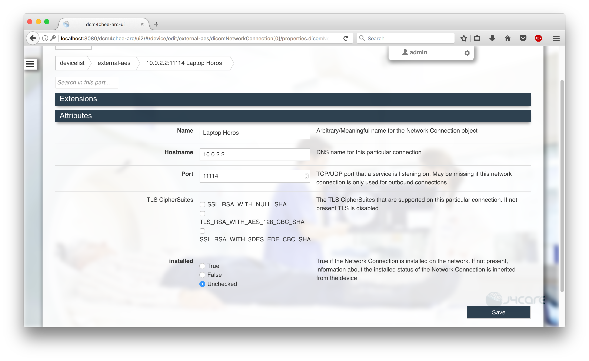
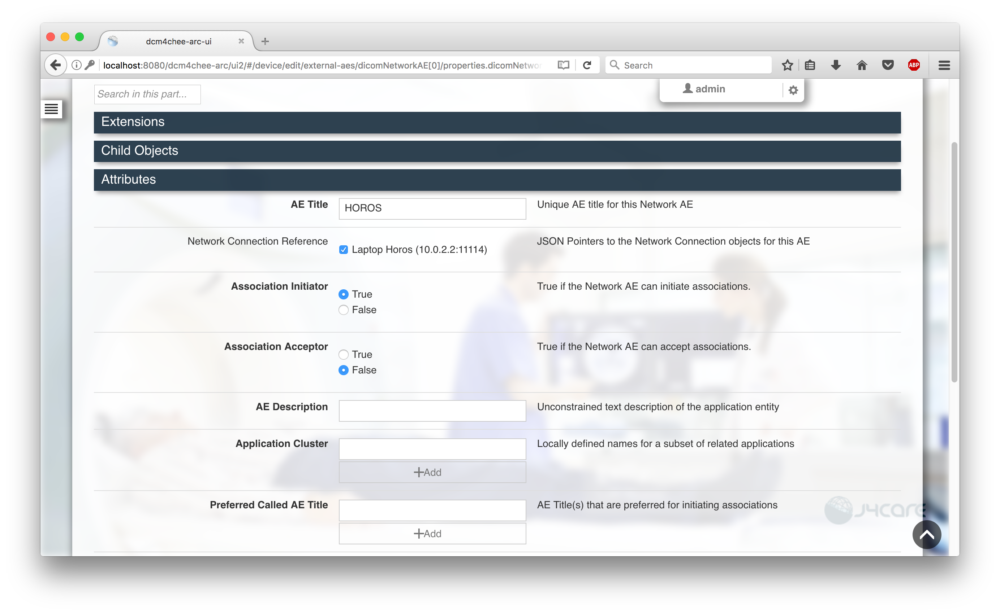
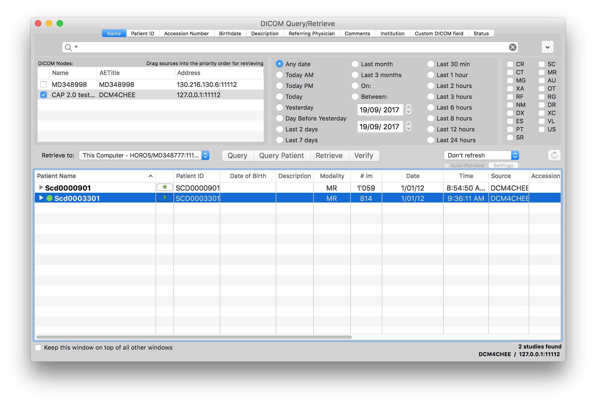

# HOROS connection with DCM4CHEE-ARC server

[HOROS](https://www.horosproject.org/) is an open-source version of O$iriX. Possibly the most intuitive way to display medical images. This note provides some useful tips to connect HOROS with dcm4chee server in order to Query or Retrieve or Send images between the two DICOM nodes. Note that HOROS is actually a DICOM node client that can listen to dicom connections.

**To enable communications between two DICOM nodes, you must register (AETitle, host address, port) tuple of one DICOM node to the other, and vice versa.**

My settings:

* dcm4chee-arc:
  * AET = DCM4CHEE
  * address: localhost:11112

* HOROS:
  * AET = HOROS
  * address: 10.0.2.2:11114

## SEND images from HOROS to dcm4chee-arc

1. HOROS: Preference -> Locations
2. Add new node: Address=127.0.0.1, AETitle=DCM4CHEE, Port=11112, Q&R=checked, Retrieve=C-MOVE
3. Click Verify button (make sure you ticked the node)
   
4. There are two ways to send a study:
   1. Use SEND button.
   2. Drag & drop a study to the Sources list on the left bar.
   

## QUERY/RETRIEVE images from dcm4chee-arc to HOROS

### Registering HOROS AE on dcm4chee

1. HOROS: Preferences -> Listener
2. Verify AETitle=HOROS, port number=11114, and addresses are correct.
3. Open dcm4chee-arc/ui2 webpage and login as admin.
4. Go to Configuration
5. Select `More functions` -> Create device, and I want to group all external AEs into one device. So I named the device as `external-aes`.
6. Click SAVE button.
7. In the Child Objects section, add Network Connections, enter name, Hostname=10.0.2.2, Port = 11114.
8. Click SAVE button.
   
7. In the Child Objects section of the external-aes device, add new AE: AE Title=HOROS, Network Connection = the one you just created in 7, Association Initiator = TRUE, Association Acceptor = False.
8. Click SAVE.
   

### QUERY

1. From HOROS: click Query button.
2. Select AE = DCM4CHEE.
3. Click Verify button.
4. On the search bar, put `*` to search all patients and hit ENTER.
5. You should see the list of patients.

### RETRIEVE patients

1. From the same DICOM Query/Retrieve dialog box.
2. Check where you want to retrieve to.
3. Select stud(ies).
4. Click download / retrieve button.
